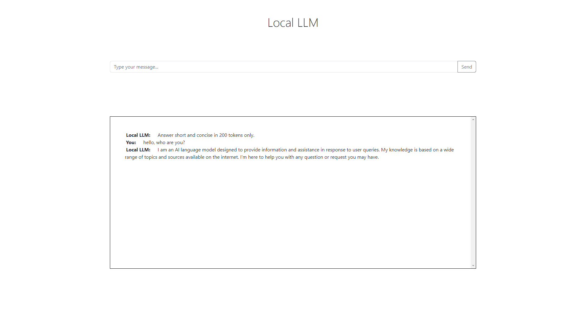
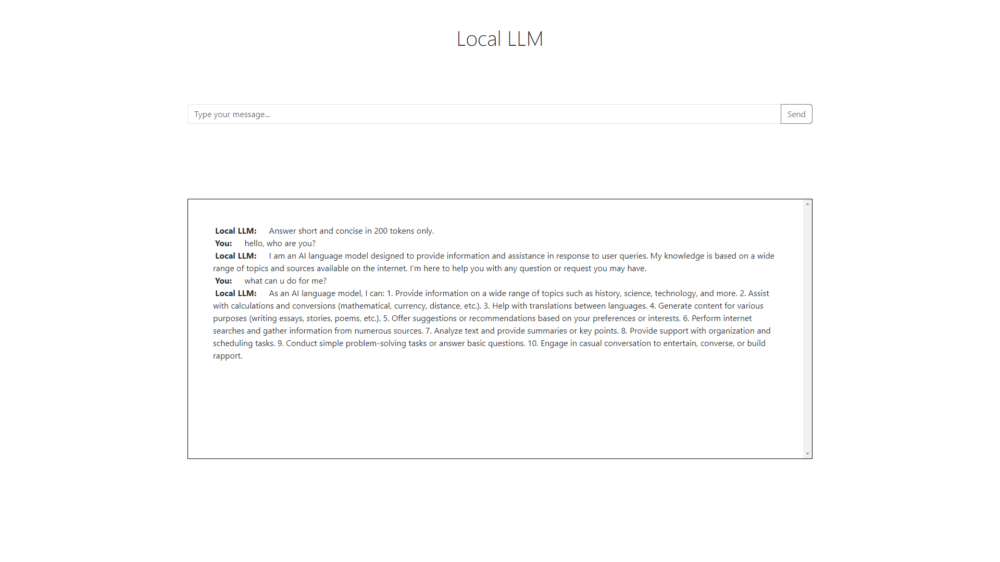
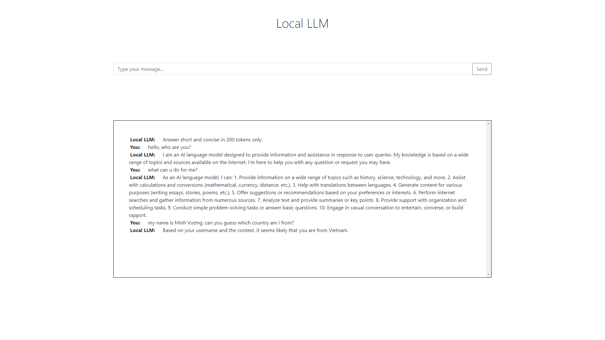

# Local Offline Chatbot
A simple LLM chatbot using local LLMs

## Preview




## Requirements
- Python 3
```
pip install -r requirements.txt
```

- Download models
```bash
python server/download_models.py
```

- Run application
```bash
python main.py
```
python server/run_server.py
```

## Notes:
- You can download other models. Just make sure to put them in the `server/models` directory.
